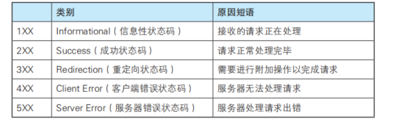

## 状态码
+ 位于请求行和状态行中
+ 由数字和原因短语所组成 例如 200 OK
+ 总共分为1xx 到5xx ,5大类
+ 1xx 文中没有提及
+ 2xx 代表请求正常处理完成
+ 3xx 需要你增加一些操作来完成

### 2xx中(恭喜你访问资源成功)
+ 204 服务器返回一个响应报文其中不包含任何实体数据,只有一个响应头部,这个一般是客服端页面不需要更新的时候返回
+ 206 : 客服端只想请求文章中一部分内容返回]

### 3xx中(地址变了)
+ 301 URI原来的地址不能用了
+ 307和302 URI临时被改变了,希望使用新的URI来访问
+ 303 我服务器希望你使用GET重新访问
+ 304 你的需要的资源存在,但是你的请求报文中的资格未满足

### 4xx中(不许你访问,你要的资源没有资格或者没了)
+ 400 请求报文中语法错误
+ 403  不许你访问,如果想看原因,在响应报文中实体主体部分可以观看
+ 404 服务器没有找到你的需要资源,所以拒绝了你的请求

### 5xx(主要我服务器自身出了问题)
+ 500 服务器出了BUG
+ 503 服务器超载 ,停机维修