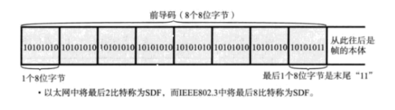
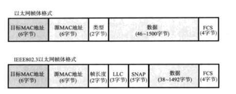

## 两种物理结构的型号传输方式
+ 他们主要解决信号传输之间的冲突

### 第一种 共享介质型网络(半双工)
+ 这种网络连接使用环形拓步,所以如果两台计算机同时发送信息,就产生了冲突的问题
+ 下面两种方式都是半双工,计算机只能上传时,就不能够下载,半双工意味着一根网线我直接上其中的四根.
#### 解决方式1 争用方式(CSMA/CD)
+ 任何计算机都可以发送信息,一旦出现了数据冲突,就把数据抛弃,等待一段时间,接着发送
  
#### 解决方式2 令牌传递
+ 各个计算机公平的获得令牌
+ 不会产生冲突
+ 只有拿到令牌的笔记本才有资格发送信息
+ 当数据帧转了了一圈没人要,发送数据帧的计算机就会丢弃数据帧,然后将令牌传给下一个
  
### 第二种 非共享介质的网络(全双工)
#### ATM
+ 利用交换机来交换数据
+ 因此计算机只有与交换机点对点的交换数据,因为交换机上面有很多网口,所以笔记本他们都不用考虑是否存在传输冲突的问题,他们只要发送数据到交换机一对一,交换机上面分配数据到各个计算机,在交换机内部分配到不同的线路上,就没有两台计算机共用一根网线的现象.
+ 全双工意味着,他的需要8根线路同时接通,4根上传,4根下载,互补干扰

## 交换机通过转发表来转发数据
+ 他是如何知道各个主机所对应交换机上面的网络接口对于不同地址的主机的呢
+ 现在处于数据链路层,所以我们处理的是数据帧,同时交换机上面的端口实现了网桥技术,他会自动学习记录MAC地址到转发表中.
---
## 环路检测两种技术
### 生成树方式
+ 通过网桥之间的通信,知道了那些端口没有被使用,出现了环路,就把信息通过这些没有被使用的端口传出去,缺点: 时间过长

### 源路由法
+ 类似于路由的功能 把帧写到RIF中,利用RIF提供地址,发送到目的地址

---
## 利用VLAN划分不同的网段,而不用改变主机的物理布局
+ 比如一台交换机,如果我们原来把两个不同的网段的主机划分开,需要两台交换机,现在我们利用Vlan就可以实现一台交换机,划分不同的网络接口到不同网段
+ 每个Vlan网段会用Vlan ID加入到以太网数据帧的首部,决定了数据最终流向那个网段
+ 我们只需要用网段就能区分主机了而不用再改变

---
## 以太网数据帧

+ 以太网帧的主体内容在签到码末尾 SFD后面
+ 类型: 代表上一层所使用的协议
+ FCS : 检验是否收到了损坏
  
## 还有其他很多种协议
