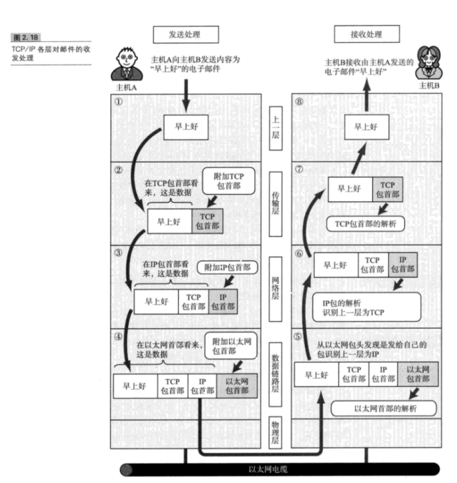

## 各个协议
### ICMP
+ ip协议保证数据尽可能的传输,但是不能保证数据的顺序和丢失,所以ICMP 有效的转发IP数据包和提高交付的成功机会

### ARP( Address Resolution Protocol)
+ 从iP数据包里面解析出MAC地址

### UDP
+ 无连接的传输层的协议,所以他适用于多播和广播
  
### SMTP(Simple Mail Transfer  Protoc)
+ 电子邮件传输协议

### FTP(File Transfer Protocol)
+ 一般建立两条TCP的线 第一控制连接  ,第二 实际传输数据连接

### SNMP(Simple Network Management Protocol)
+ SNMP 应用层专门管理网络相关问题

---
## 数据包的封装过程

+ 数据从上往下层层封装
+ 每个网络层级都会吧首部和目标地址添加进去
+ 下一层的首部会指向上一层是哪个协议
+ 为什么需要下一层指明上一层的协议,例如 :网络层的IP会指向传输层是TCP还是UDP协议,如果是UDP就把这个数据包交个UDP来处理,所以这个指向的协议,会让数据包下一步应该走到哪个协议处理器中.
+ TCP收到数据包,计算校验后检查是否受损,如果没有,根据端口号,把数据包交给不同的程序.
