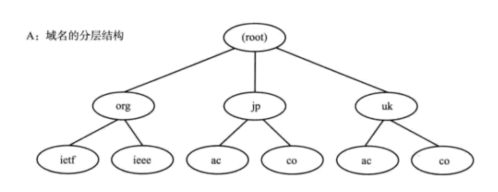

## DNS域名解析服务器
+ Pepper.Kusa.ac.JP (其中 Pepper是主机名,也同样就是所处DNS树形结构中最下层的那台服务器,也就是存储了这段网址,真实IP地址,服务器关联了Pepper和IP地址,客服端就可以拿到这段地址,去访问网址)
+ 关联主机名和IP地址是因为,主机名更加方便访问,
### 那么如何从域名+主机中解析出IP地址呢?
+ 第一 笔记本优先访问本机的HOST文件,如果没有ip,向外发送请求
+ 第二 DNS服务器他是存在分级存储的

+ 第三 访问从根服务器开始,他记录着一级域名的DNS服务器地址,比如不同国家的服务器,这样我们理论上可以拓展无限台DNS服务器,同样也可以关联无限的IP地址.

---
## ARP工作机制和两种解析方式
### 工作机制
+ 能够执行ARP协议的物理设备包括笔记本和路由器

### 两种解析方式
+ 局域网下 : A主机向B主机通信,A发送ARP的请求包,包括了想请求的IP地址,和A需要B的MAC地址,B主机发现请求IP地址和自己相同,发送ARP的相应包包含了B的MAC地址,再由交换机的转录表来转发.
+ 物联网下: A主机发送IP包,到达了最后一个路由器时,路由器看IP地址相符合返回MAC地址,故此找到了真实的地址.

---
## ICMP网络管理员
+ ICMP返回出错的错误消息. 
+ 诊断查询消息 -辅助IP诊断ICMP
### ICMP提供的服务
+ 可以有主机和路由器返回
+ ICMP 重定向 由于返回的不是网络最优线路,路由器返回
+ ICMP 超时 TTL=0
+ ICMP 回送消息 返回应答消息 用户可以使用ping
+ ICMP 原点抑制 网络拥堵返回网路拥堵的情况
+ ICMPV6 ICMP在IPV4只是辅助功能,ICMP在V6中具有举足轻重的地位,ARP直接转换成ICMP探索消息.这个消息融合了IPV4的ARP ICMP重定向等.

---
## IP隧道技术
+ A:ipV6  -> B:IPV4  ->C:IPV6  不同网段使用的IP协议不同,如何让他们直接通信呢
+ 要用B网络通信,B只有iPV4是不支持的.但是我们可以在IPV6的数据包后面加一个IPV4的首部,这样就能通信,这种添加首部的就叫座 IP隧道技术,
+ 多播无法传出其他的网段,我们也可以给多播增加一个IP首部就可以传播了

---
## IP多播
+ IGMP两个作用
+ 向路由器表示自己想要接受多播消息
+ 向交换技术器告诉自己的地址,让交换不要过滤发送给自己

---
## IP任播
+ 110和119这样的紧急电话,你在不同的县里面拨打,你就会打给当地县的派出所,虽然都是110但是可以把110关联不同的IP地址,同时110电话请求会交给最近的服务器,来实现打个当地的公安局.

