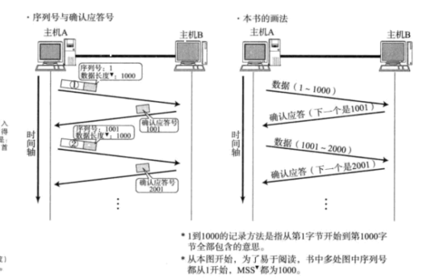
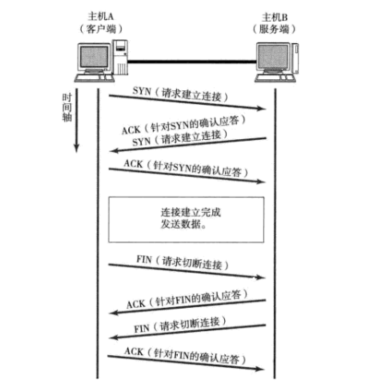
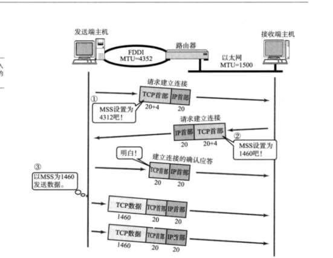
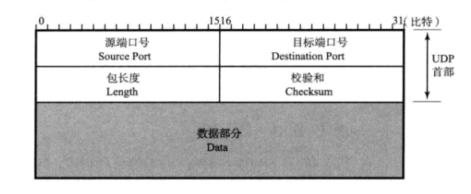
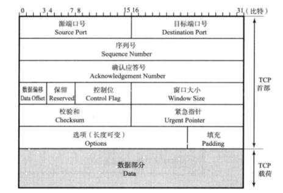
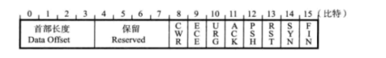

## 传输层TCP/UDP中我们通过五个标识来确定一个通信
+ "原IP"+"目标IP"+"协议号"+"源端口"+"目标端口"
+ TCP和UDP端口号都是80 ,但是因为协议的不同,所以他们都代表了不同程序的通信

### 端口号
+ 一个程序他要与外界通信,一般都采用TCP和UDP的混合,但是光靠80端口和两种不同的协议来区分,显然无法适用于那么多的程序,那么就意味着一个程序一般对应一个端口号

### 端口号的分配
+ 静态方法, HTTP FTP 他们的端口就是固定的
+ 时序分配法  操作系统动态管理端口号

---
## TCP和UDP特点
### UDP
+ 面向无连接服务,不管发送的套接字如何,也不重发,多用于视频,微信电话,协议简单可以,随时发送

### TCP
+ 拥有检验和序列号 确认应答,重发控制,管理,窗口控制 这些都是TCP提供的服务

---
## 这些都是TCP提供的服务
### 序列号 
+ 客户端开始发送数据的起点,可以不是0,等,服务器返回应答号+1,来向客户端应答自己接收到了数据,同时如果数据丢包,服务端会一直要求你发送丢包的数据
+ 

### 重发超时
+ 如果主机A一直发送还是收不到应答,A就认为网络出现了问题

### 重发控制
+ 接受端收到数据包1001他就需要下一个1001-2001数据包,但是因为网络主机A的1001-2001数据包丢失,接收端就会连续发送需要该区段的数据包请求,发送端连续3次收到了同一确认应答1001-2001请求,就会重发.

### 流量控制
+ 接收端应为他的缓存大小有限,这个就是窗口的大小,如果满了就告诉发送端让他等待,发送端会时不时发送一个窗口探测包
  
### 拥塞控制
+ 如果大家的主机同时发送大量数据包,容易造成庸才,拥塞窗口大小和接收端窗口控制传输数据大小,发送端每次收到一个ACK,拥塞窗口指数增长,这样就实现了满启动,数据包的转发由少到多,慢慢增长,重发也可以采用这种.

---
## TCP连接
+ 主机A和B 两个都要发送SYN建立连接,ACK答复
+ FIN切断连接,都要发送,ACK应答

+ TCP会在建立连接是,确定最大连接长度,TCP首部用MSS来确定大小,会在两个主机通信之间选一个最小的来定义数据包的大小

---
## UDP和TCP首部

+ 序列号: TCP三次连接和断开,接收端会发送SYN包和断开FIN包不带数据,其中夹杂着一个字节加一的序列号
+ 确认应答号: 接收端给发送端发送下一次希望接受到的数据,当你发送这个是,默认接收端已经收到了这个数字之前的数据
+ 校验和: 验证数据包是否被破坏
### TCP首部中控制位 :比较重要

+ ECE: 设置为1时,通知对方,网络有拥塞
+ URG:为1时,紧急处理的数据
+ ACK:接收端接受TCP连接为1
+ PSH: 为1时把数据向上转
+ RST:为1时 异常青雉断开
+ SYN:为1时 希望建立连接
+ FIN: 后面不会再传输数据断开连接
 

---
## 其他改进协议
### UDP-lite
+ 相较于UDP增加了检验socket的功能

### SCTP
+ 以太网和无线lan同时连接时,他们会分配不同的IP地址,TCP发送和接受使用同一个IP地址,更换断连,SCTP就是解决这个事情的

### DCCP 
+ UDP版本提供了拥塞控制.