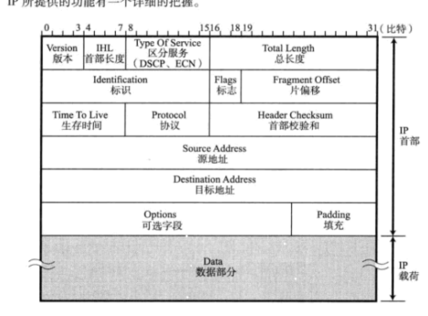
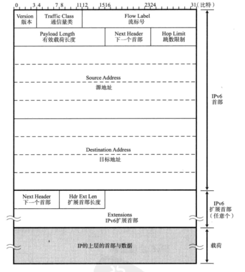

## IP主要分为三大模块
+ IP寻址
+ 路由转发
+ IP分包与组包

### IP的特性
+ IP网络层他的任务就是注重 "尽最大努力发送给目标地址,这样无连接简化和提速了传输数据

### IP寻址和路由
+ 路由器转发数据前会先查询路由器制表,该表记录IP数据发送的下一个路由器,路由器本身有一个IP地址,路由器会把数据包交给最近的那个路由器,并不知道目标主机所处的现实空间方向.

### IP分片和处理
+ 因为不同的数据链路层拥有不同的协议和物理线路状态,所以对于完整的一份文件我们需要切分成不同大小的数据包,MTU就代表了该数据链路线路最大的传输单位,所以IP协议需要将他们切片
  
### 让路由器进行切片出现的问题
+ 原来的MTU由路由器切片,所以上一个路由器切完以后,可能下一个也要切片(切换到不同线路),这样就给路由器造成了巨大负担

### 路径MTU解决切片负担问题
+ 主机将分片的禁志位设为1,这样路由器看到数据包直接丢掉,在整个线路上,利用ICMP(网络管理员)来得到一个合适的MTU值,让主机进行切片解决问题.

---
## IP相关知识
### 两种广播 他们都拥有自己特殊地址
+ 本地广播 :不会跨网段
+ 直接广播 :其他网段也会转发这个数据包
+ 多播 在自己的网段中 ,全部都可以接受这个消息
  

### CIDR
+ 对于A类和C类的固定区域划分,在网络位中,有很多是浪费的,比如在IPV4第三段,只有177时,后几位就可以把它当做主机地址,主机数量可以大幅度增加,通过子网掩码来实现

### NAT
+ 局域网地址192.168开头的转换成公有地址的协议.

___
## IPV4的首部

+ version 4->ipv4 6->ipV6
+ IHL: 表明IP首部大小
+ ECN :报告网络拥挤的情况
+ 标识 (ID :identification) :用于分组重组,每发一个IP分组包后,数值增加
+ 标志 :用于展现分片包所在的状态 
+ 片偏移 : 标识每一个分段相较于原始偏移了多少
+ 生存时间:TTL 包的生存时间,每过一个路由TTL减一
+ 协议:IP首部下一个协议属于那个TCP还是UDP
+ 首部检验和:确保IP数据包不受破坏

---
## ipV6的首部

+ 流标号:准备用于服务质量控制(Qos quality service)
+ 有效载荷长度: 只包含数据部分的长度
+ 下一首部: 指明上一层协议TCP
+ 跳数限制:有效生存期 Hop Limit 每过一个路由器减一
+ ipV6 扩展首部
+ ipV6 抛弃了IPV4的固定长度,而是在IP首部和TCP首部中间加了一个可以随意长度的扩展首部