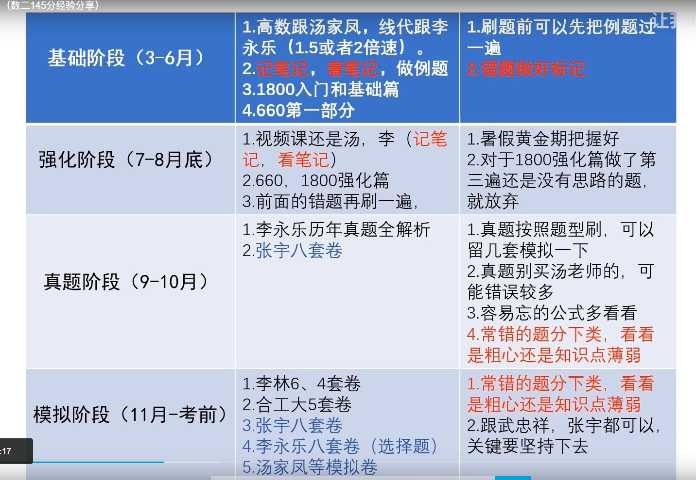

(2 到3刷才开始展现自己的厉害)

## 基础阶段 3-6月 (1800 2遍,600一阶和2阶各一遍,最少1阶刷一遍.)
### 高数
+ 汤家凤的视频走一遍,他写什么笔记,你就写什么,
+ 比如第一章是极限,你看完以后就去做1800的极限部分,做之前看一遍他的笔记,公式忘了立即查看,前期不要慌张,大家都是这样,到第二遍第三遍的时候你才厉害.
+ 注意保持做题的书面整洁,在A4纸上面去写,一定记住好好写草稿!
+ 做错的部分和多个答案和蒙对的,你就在前面用圆圈中间写个1,代表你一刷时候的错误,如果二刷也错,建议换种颜色.
+ 简单的一周,复杂的2周半.
### 线代
+ 李永乐的线代(好像是本科课程),没有书,跟高数一样做笔记
+ 接着线代,看完一章,做汤家凤的,可能李永乐的方法用不上,不要害怕,后面二刷,你就觉得很简单,因为李永乐的视频课程好一些.

## 高数强化部分
+ 跟武忠祥的强化部分,看一章,复习全书,然后总结(重点笔记),然后做1800高数强化,再660