+ 光栅化就是将3D物体显示到2D屏幕上去
+ 实时图形学 指的是每秒钟30帧画面光栅化                                                                

---

### 二维变换
+ 齐次坐标点的引入(首先是基于2D层面)
  + 原来我们对于平移最好的方法就是直接矩阵加平移量,但是这有悖于我们利用矩阵乘法完成旋转和缩放的操作,为了同一这样的矩阵乘法,引入齐次坐标格式
  + 我们对于2D的点增加了w为1,这里理解认为,若果w为0就代表这个坐标是vector,为1就是点 ,引入了齐次坐标也符号点的运动
  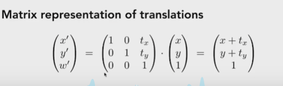
  + 第一行 vector的w都是0,最后值也是0,所以向量相加为向量,这个很符合逻辑
  + 第二行 point w为1,所以点的减法是向量,你理解一下,点的坐标相减不就是矩阵吗
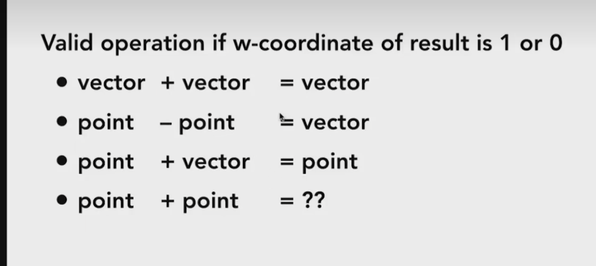

+ 所以2D的平移变换我们都使用齐次坐标的乘法矩阵解决
  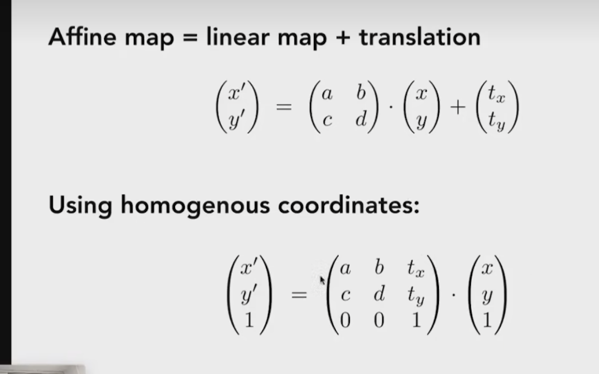

+ 自然旋转和缩放利用齐次坐标的变换也是成立的.
  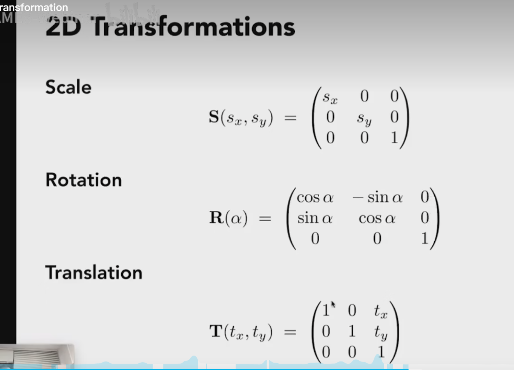

+ 旋转矩阵:
  + 从公式中我们可以发现,旋转矩阵的逆矩阵就等于矩阵的转置
  + 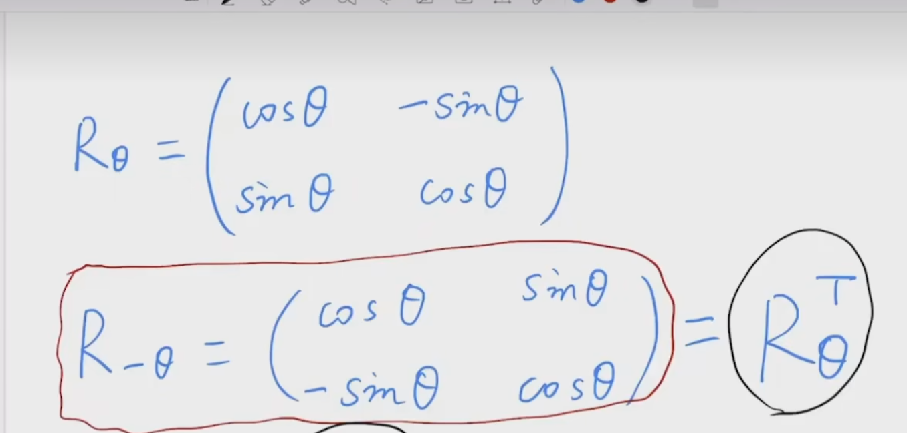  
-----

### 三维变换
+ 三维对于矩阵而言我们也可以使用齐次坐标解释,1依然代表点,0代表矢量
  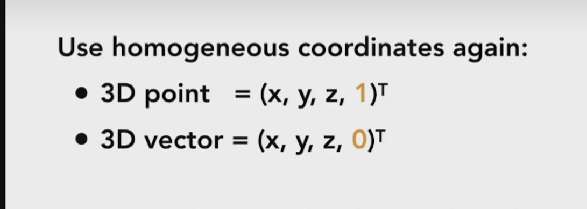
+ 同样的套路,这里我们需要分析一下,如果a e i 不为0,那么就应该是先缩放,然后平移,这是因为 a和x是运算的优先级,乘法先算再算加法,自然先缩放在平移
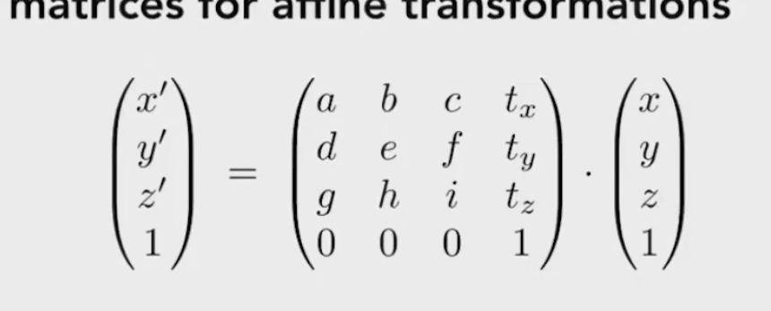

#### 三维旋转
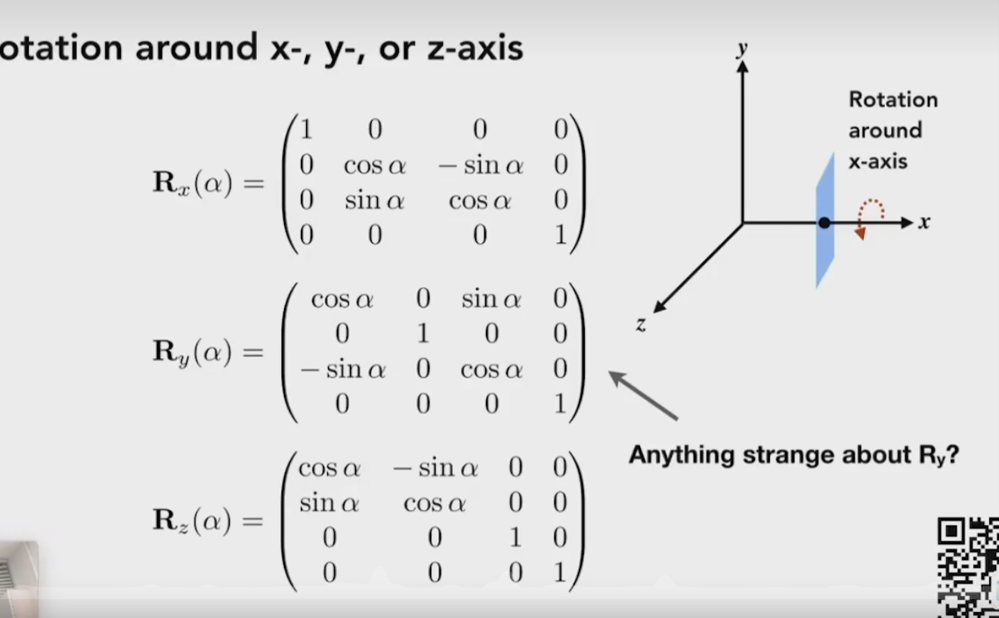
+ 这里对于旋转 我们一般认为是绕着原点,和穿过原点的轴旋转,如果是绕着任意轴进行旋转会是怎么样,其实你完全可以先平移到某一个位置,旋转,再平移回去就非常好了

---
### 投影和透视
+ 对于这两种变换,其实就是摄像机锁看到的画面,因为摄像机位置不同,方向不同,看到的画面自然不同,因此我们固定一个摄像机的标准位置和方向,摄像机处于原点,同时看向右手坐标系的-z方向
+ 其实只要你相机和物体保持相对运动,就可以看到同样的画面,自此,物体和相机都要同时运动
    + 自然我们要将摄像机移动到标准位置就是首要解决任务(图片中进行了解答)
    + 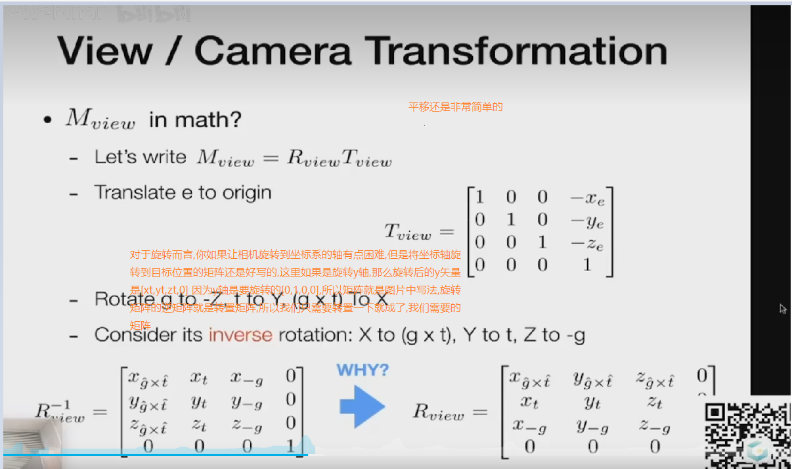

### 正交
+ 首先定义一个长方体,然后将长方体规范化为一个基于坐标系的标准正方体(这个长方体形体比较规整,他是对空间的截取)
    + 长方体代表什么,因为你是正交透视,所以你要选择的某一块空间,长方体自然代表你要看到的空间模型,因为摄像机是在-z上面,所以你只要舍弃z轴,保留x和y轴自然就得到了正交透视
    + 这也是为什么需要将长方体变成正方体,至于物体的拉伸,正方体内部还会有一次变换
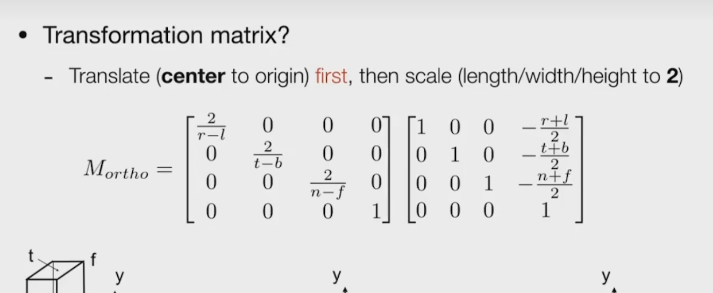

---
### 摄像机视角
+ 透视我们先把它压缩成我们需要的正方体,利用摄像机标准视角去观看这个正方体,然后将正方体的相关信息一一对应到像素点上去,这个就是光栅化过程.
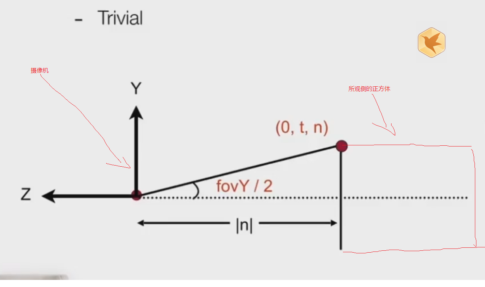
+ 像素点对应过程:
  + 像素点他是具有 位置如图片所示,现在你需要做的就是将将你截取的正方体空间中的点对应到每个像素块中,正方体的是-1到1所以边长为2,但是像素点保持1的自身点
  + 最后cpu告诉像素点每个显示什么颜色,这个就是光栅化
  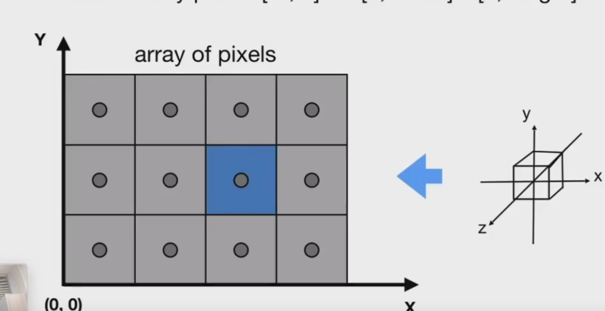
  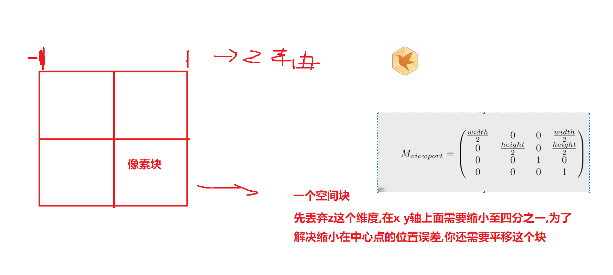