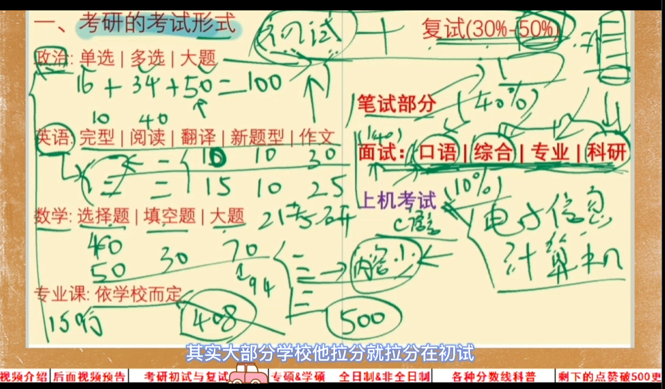
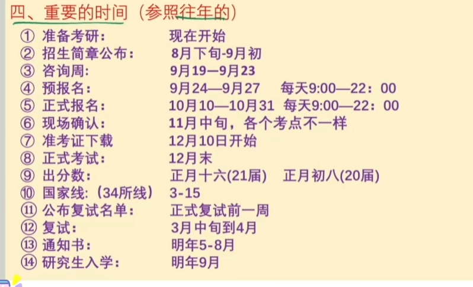
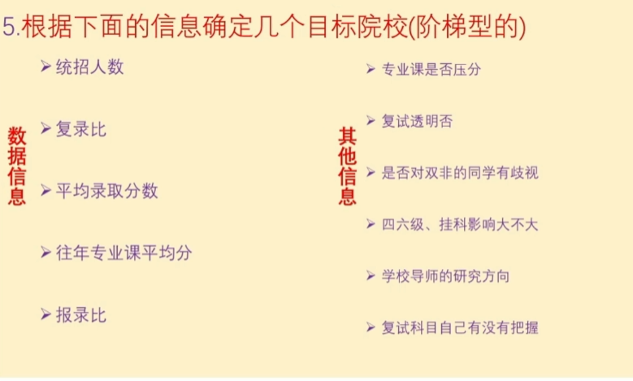
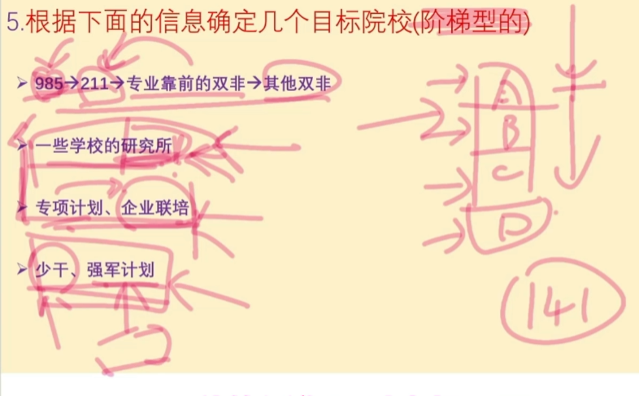
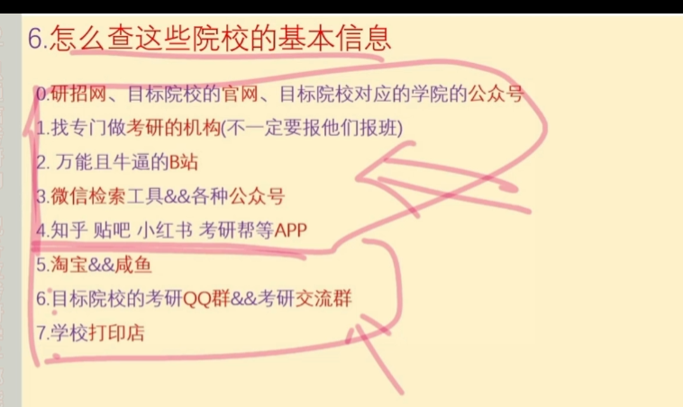
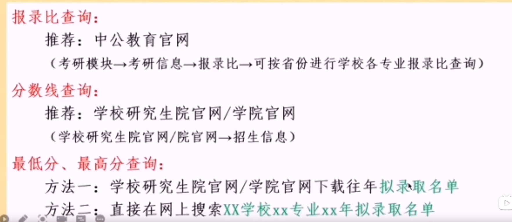

## 学硕和专硕 全日制和非全日制
+ 应届毕业生一般都是全日制
+ 学硕和专硕只关系读博问题

## 各种分数线
+ 国家线(a b区划分不同)
+ 单科线 国家线下面 对于英语这些科目还是有要求的,并不是英语规定了 2020年 37分,但是你肯定得考高一点
+ 校线  有的211学校,他们有自己的总分数线,此时国家线没有多大意义.
+ 双科线,有的学校 他要求你数学和英语的分数线达到150 所以你数学90 英语必须60分,所以得到一个结论,你不能偏科,都得考高一点.
+ 往届录取的分数线 这个他比较特殊,有 的学校他进复试标的是国家线240 但是他的平均分数线是290,这个说明你至少考340分(很少差距那么大的),为什么会这样,因为国家线是划分给本校学生的,你得估算你的学校.

## 重要的时间节点

+ 第二 有的学校会调整数学考试范围会在这个时间点, 专业课一定要注意变动,有的学校仁慈他说专业课会换掉会在5到6月份,有的学校在8到9月跟你说.
+ 第三 咨询周 你可以去问老师学校的情况,但是往届他们下面有留言,所以你可以趴贴子
+ 第四 预报名 要选择考点,所以你可以选择附近的考点
  
## 同等学力加试
对于专科,不是跨考

## 双飞快211 歧视
网上贴子,他会出现歧视,他是有个别学生具体到某个专业某个老师出现的现象

## 择校需要关注的信息
+ 统招人数
+ 平均录取分数  有的学校他的前几年分数特别稳定340左右,如果你觉得你能考340你就直接考这个分,其他不用想
+ 复录比    有的2:1 3:1(这种不太建议考)
+ 专业课平均分

## 在选择完专业和地区以后,择校细节

默认排序从左往右
+ 第一 当然是统招越多越好,几个人的需要认真考虑,因为他可能是留给本校学生的
+ 第二 一般国家比例是1.2:1 12复试刷两个所以2:1 和3:1的要慎重
+ 第三 平均录取分数 这个你需要算他们平均分数,比如西电 350上一年的录取分数线,但是你考350就容易被刷,所以他的平均分数是360 你考360这个就没有太大问题 至少统招人数大于10个才有意义
+ 第四 往届专业课平均分,比如你总分300分,你看起来他这个学校录取分数低,但是如果专业课只有20分(极端一点),这个就导致你除去专业课你需要考的高,这样你就当注意了.
+ 报录比 这个不太重要,因为3到9月有些人没好好复习没考,9月11月考不起有人放弃,考试中考的放弃了.所以不重要,主要你的注意他的平均录取分数,你觉得考得到他的分数,你就可以冲一冲.

+ 第六 专业课是否压分,复试透明度,这个很好解决,一般改卷都是顶装在一起的,所以老师压你分,那么最多大家都低,同时前年有人专业课5分,这种院校得放弃.
+ 最后一项,比如有的复试笔试中考了软件工程的数字电路设计,这种你就得注意一下是否放弃报他.

## 院校排名

+ 你觉得你考的实力差一点 还是可以考虑 研究所和专项计划,企业联培

## 院校信息查找

+ 专业课信息,最终冲击的时候,你需要学校专题卷,可以去学校qq群购买

