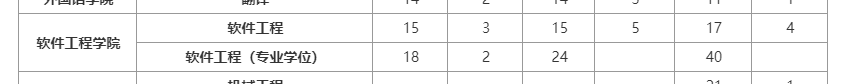

## 考试科目
  + 考试科目 先是英语 后面 数学 专业课
## 昆明理工大学  
+ 29人
+ 二 二 数据结构

## 武汉工程大学 
+ 6人  都是保送的

## 湖南师范大学
+ 14人
+  二 二 数据结构

---
## 福州大学
+ 20人 
+ 2 2 408

+ 0人

## 武汉理工大学
+ 学 
+ 22 人
+ 1 2 408

## 广西师范大学
+ 学
+ 30人
+ 一 二 计算机专业综合 806

## 贵州大学
+ 学 
+ 25 人
+ 1 2 840)程序设计与数据结构
+ 《C语言程序设计教程》，朱鸣华、刘旭麟、杨微主编，机械工业出版社；2、《数据结构（C语言版）》，严蔚敏、吴伟民主编，清华大学出版社。

## 大连大学
+ 学
+ 20 
+ 一 二  (836)数据结构

---
##  数学二 和英语二 
+ 昆明 理工大学
+ 成都理工大学
+ 西南石油大学
+ 重庆邮电大学  含推免 62人
+ 佛山科技技术学院 
+ 广东外语外贸大学
+   广州大学
+   华南师范大学
+   湖南师范大学
+   武汉工程大学
+   河南大学
+   河南科技大学
+   郑州轻工业大学
+   烟台大学
+   青岛大学
+   聊城大学
+   山东师范大学
+   江西师范大学
+   江西理工大学
+   东华理工大学
+   华东交通大学
+   南昌大学
+   闽南师范大学
+   福建师范大学
+   福州大学
+   阜阳师范大学
+   东北林业大学
+   长春理工大学
+   辽宁石油化工大学
+   沈阳工业大学
+   大连理工大学
+   太原科技大学

## 重庆邮电大学
