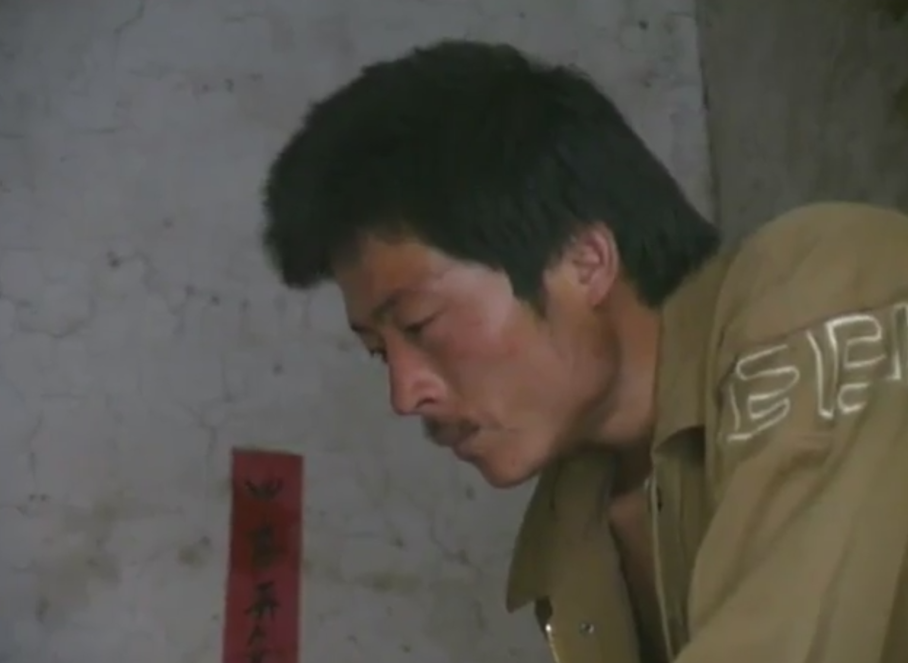

## 镜头语言

《好死不如赖活着》围绕着家庭生存的现实，通过马深义与雷妹种种挣扎反抗视角凸显出艾滋病的残酷之处，无辜的受害者马荣三姐弟承担着本不应该承担的疾病和家庭责任。马深义视角下的无奈与偷生，雷妹视角下的平淡生死观和对子女的担忧，马荣视角下的分担家庭责任的过早成熟，马茹和马占槽视角下身体发育的问题，多角度多层次地暴露这个家庭所面临的种种难题。艾滋病患者如何生存，远比影像中展示的一家五口的现实情况来得更复杂，更残酷。人性在《好死不如赖活着》中展现得淋漓尽致。当然，另一方面，主题混乱是多视角叙事的通病，因此，多元的人物与情节塑造共同的影片主题是一种挑战。

对生活流的影像记录是所有电视纪录片的共同特点, 因此人们甚至把纪录片定义为“讲述老百姓自己的故事”。但不是所有的日常故事都值得记录, 也不是所有对生活进行记录的影像都能称为纪录片。如监控录像对人们的日常行为的拍摄记录, 就不能称之为纪录片。日常生活在纪录片中不是自然主义地呈现, 而是主观观照的结果。因此日常化的场景在纪录片中暗含了创作主体的情感评价、道德评价, 是创作者审美视野中的“日常”。中国新纪录运动的研究学者吕新雨说:“纪录精神是对人的真诚, 平等的尊重和倾听, 是对生活真相的敏锐、勇敢的探索和质疑。[1] (P300) ”纪录精神是一种审美精神, 它力图通过记录“个体”或“现象”体现群体与本质, 力图通过对“真”的展现, 抵达对精神超越之“美”的领悟, 在这一点上, 区别了一般纪实片特别是新闻纪实片与纪录片在美学形态上的差异。前者往往由“真”导向“善”, 即公正合理的社会评价。而后者要达到的是由“真”导向“美”, 即对生命的思索与审美领悟。对于纪录片的“真”与“美”的理解, 可以借用语言学的“能指与所指”理论。如果说每一个对于“日常生活流”进行纪录的镜头, 是纪录片的“能指”, 那么作品中蕴涵的创作主体对“日常生活流”的探索、质疑、体悟, 就是纪录片的“所指”。 (1) 显然, 在纪录片创作中如何提炼“日常生活流”中的诗意, 创造“能指”与“所指”, 即“镜头”与“意蕴”之间的审美内涵, 是纪录片成功的关键, 也是纪录片富于审美特性从而与其他纪实片相区别的重要因素, 而在这个过程中, 如何让“真”导向“美”, 而不是“丑”或浅薄的道德评价至关重要。因此从这个意义上说, 不是所有的现实题材都合适拍摄成为纪录片, 纪录片的审美性也不仅仅存在于拍摄技巧、视听精良等表现手段上, 更为重要的是它要通过记录客观生活影像传达主体的审美精神:时光流逝与镜头连接中传达出的对生活和生命的体悟, 这才是纪录片的艺术精神核心。

纪录片《好死不如赖活着》就极富审美内涵, 这种内涵源于导演对大事件中小人物的生活意义、生命意义的探索, 从对“真”的展现中传达出了对生命之美的发现。该片的拍摄大背景是当时河南“艾滋病村事件”, 它引起了全国乃至全世界媒体的关注, 但此片无意于高屋建瓴地挖掘这一现象产生的复杂而深刻的社会原因, 它大量采用低机位拍摄方式, 拍摄人物形声一体的日常生活画面, 其中主要为中近景镜头, 旨在展现在艰难困厄、没有希望的人生中小人物们怎么执著地活下来, 又怎样承担生命的责任。片中的马深义一家由于卖血, 他和妻子雷妹感染了艾滋病, 两个孩子马荣和马占槽均由于母婴传播成为了艾滋病病毒携带者, 母亲雷妹发病时, 最小的儿子马占槽还只有半岁。从夏至、大暑、中秋、霜降、立冬、冬至到春节, 作品真实记录了这一家人在季节变化中, 经历的死亡与成长。片中的日常生活场景按人物关系可分为三类:一是马深义与雷妹夫妻之间;如未发病的马深义用板车推着已发病的妻子去村西头打免费吊针, 搀扶着妻子给她喂牛奶, 妻子死后为她守灵, 祭祀;二是父亲马深义与三个孩子之间;如马深义鼓励大女儿好好读书, 为小儿子喂药、擦屁股、洗脸;教孩子走路, 过年给每个孩子买来新衣裳;三是孩子们之间;如唯一未被感染的大姐马妞回家做作业, 给弟弟喂饭、给妹妹换衣服等;按照作品的内部结构来看, 可分为死亡和活着两种日常场景。如母亲病发, 痛苦地呻吟、吃药打针, 在霜降时终至死亡, 体弱的艾滋婴儿马占槽本能地寻找食物, 能吃能拉, 甚至边吃边拉, 终于在第二年春天学会了直立行走, 学会了叫“爸爸”。整部纪录片由日常生活画面串联起来, 没有特别的拍摄技巧, 没有动人的解说词, 如导演所说“没有宏大叙事, 甚至没有一段完整的音乐”, 但影片感人至深。日常的吃喝拉撒镜头承载了创作主体对于生命之美善的感动, 也让这个不平凡的艾滋病家庭凡俗的日常生活影像具有了超越世俗激荡人心的力量。艾滋病的侵袭, 让这个家庭的生存愿望变得很单纯:那就是活着。强烈的生存欲望使一个婴儿的“吃相”具有了与命运抗争的意味, 并由此迸发出生命本能的力量。艾滋病让这个农家小院与外界隔绝, 但夫妻之间的关爱, 父亲对孩子们的尽心抚养, 姐姐马妞对患有艾滋病的弟弟妹妹的爱护并没有因为艾滋病而减少, 如马深义抱怨说“我觉得我死了最好, 我的下半生没啥指望, ……小孩已经没啥希望”, 但他说话时仍然怀抱着孩子给他喂药穿衣, 想着一旦自己病发了, 躺下了怎么办?”当村西头有人劝他把生病的孩子丢掉, 他说:“这辈子再不行了, 也不能把小孩扔路口”, 明知孩子没有希望了, 父亲依然为他成长中的每一个变化高兴:扶他学步, 和他亲昵地嬉戏, 过年时买来新衣裳。尽管失去了母亲, 春节前这一家人还是把满屋都贴上了吉祥喜庆的对联, 将没有希望的人生过得简单、平常、隆重, 他们的生活并没有因为艾滋病的降临而发生大的波澜, 就连死亡也是平静的, 在死亡阴影的笼罩中, 不幸的马深义一家日常地活着, 这种日常地“活着”与未来可能的死亡构成巨大的艺术想象空间, 同时这种生命极限状态中的“生存景象”就更加显现了在苦难中生命的伟大, 因此本片“活着”的日常影像其“能指“与”所指“之间就构成巨大的审美张力:它们蕴含着对生命的渴求, 对生命力量之美的展现以及对生命责任的思考。当家庭成员之间的关爱被理解为日常的, 本能的行为时, 影片就超越了艾滋病这个边缘题材①本身, 它所内蕴的对生命意义的思考就具有了一般的普世价值。这种从个别生活体验到一般生命体验的升华“实际是一种对人生际遇共通性的揭示, 个体向群体升华的实现.也是纪录片所担负责任的完成。”[2]

纪录片《好死不如赖活着》让全世界开始关注马深义一家和整个艾滋病群体，并试图帮助和改善他们的生活，该片成为马深义这个艾滋病家庭和类似处境的人们得到更多关怀和帮助的起点。看过这部影片后，观众开始思考和关注关于人权平等的问题、关于敬畏生命的问题以及社会底层人民的生存问题。对于政府如何帮助农民解决生存问题、如何担负起一个政府该有的责任和义务，都进入到观众的思考视野。《好死不如赖活着》在记录马深义一家的苦难时，也展现了他们顽强的求生欲望和善良的本质
---

## 构图

---

## 光线

## 夏至
在这一部分我们可以看到 中间运用了 倾斜镜头，表示不安
这个镜头是片中唯一的温暖了。   8分51秒 （对于如何娶马姐 ） 他们对于正常生活也是十分向往，和期待
                            11分41秒 的时候，马姐在画面中不断的说难啊！难啊！画面速度放慢，镜头缓缓向左移动，画面和人物语言的相结合，让这几句难啊变得悠远而又漫长，同时表明导演希望声音传送的足够远，让这个世界的各个角落都能够听到，给他们一点希望和帮助。
                            12分26秒 马姐说光想笑，笑笑得劲，浮夸的动作和空洞的眼神，让马姐的自我安慰的行为没有任何说服力。反而语言和行为的巨大反差体现了他们对于美好生活的期望的暗淡和灰心，接下来的都是近景镜头，大人们在画面中悲伤，没有担忧的小孩，天真无邪的小孩还没有感受到他们父母的绝望和巨大的生活压力。
 

## 大暑

14:44 （坐在门口马姐的阴阳脸 近景）侧面光是摄影摄像中光位的讲法，举例比较多的是一种阴阳脸的说法，就是一张脸一半是亮的一半是暗的。通常在窗户旁能够利用室外的阳光和室内的黑暗对比，产生这种侧光效果。阴阳顾名思义是对比的是矛盾的。侧光也具有这样的效果，通常反映人物的矛盾复杂的内心和存在对比的物体等,此时反映了马姐无法想要早点面对死亡，结束生活带来的痛苦，但是又害怕自己的孩子缺少妈妈的矛盾心理，话语间了透露马姐的矛盾，画面上透露了马姐矛盾的心情。

## 秋分
18:23 
第一个镜头还是满地金灿灿的玉米，下一个镜头就是远处的墓碑，上一秒的收获幸福感，下一秒的凄凉悲催，情绪的剧烈转变，暗示着某种不安，雷妹的病情突然恶转，病毒已经侵入了他的大脑，雷妹已经开始不省人事了。

同样的表现手法 ，上一秒的孩子们欢声笑语，下一秒躺在推车上的雷妹，孩子们的天真，让整个家庭的快乐得以保留，痛苦和悲伤都由雷妹和他的丈夫所承担，丈夫的近景，进一步扩大这种情绪。

 

 19：07 丈夫手持一支点燃的香烟，无奈的叹息声， 未来的绝望将由他一个人来承担 ，雷妹已经无法在同他前行。
 23：12 雷妹的虚弱已经苍蝇都无法驱赶，神志不清的雷妹只是在做本能的呼吸，近景进一步放大了显示的残酷。
  25：05雷妹的慢慢闭上眼睛，暗示着雷妹的生命也即将走向镜头。

  ## 中秋
  26：16 画面整体调成黄色，呈现的画面就是阳光铺洒大地，地面上的金光耀眼，预示着希望的到来，可这一切美好的画面仅仅是导演的后期处理，直接改变画面的颜色是导演无法改变现实的最后倔强，是导演希望看到的画面，对于这一家人而言，即使是正常朴素的生活都是渴望不可求的。

## 霜降
44：:1 雷妹去世， 丈夫的主观镜头，缓慢而又承重的步伐，代表丈夫不愿意接受事实。 

52：:30 丈夫正面，下一个镜头雾气渺渺，表现了对于未来的迷茫和雷妹的思恋。

## 立冬